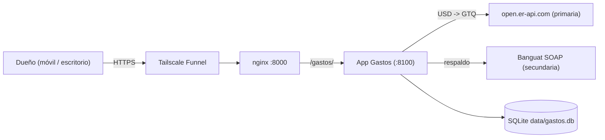
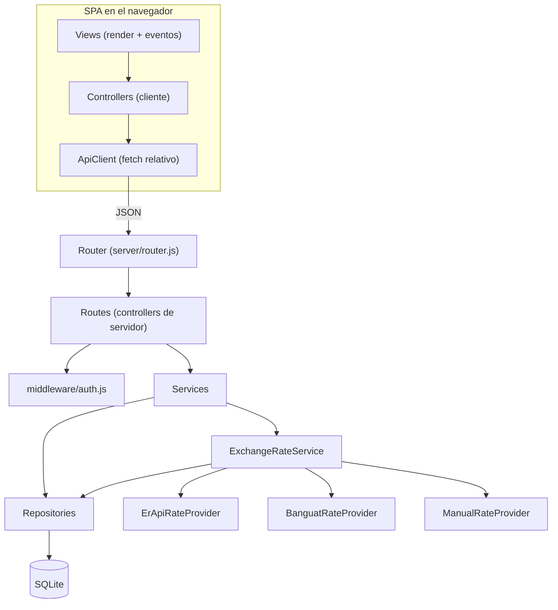

# ARCHITECTURE.md — Gastos

**Versión:** 1.0.0 · **Estado:** Fase 0 (diseño cerrado, sin código)
**Ámbito:** decisiones arquitectónicas, capas, esquema, puertos, amenazas y ADRs.
**Precedencia:** ante conflicto, **este documento gana sobre las guías genéricas**; ante conflicto
con la realidad medida, gana la realidad (se corrige el documento).

---

## 1. Stack tecnológico

| Capa | Tecnología | Versión / nota |
|---|---|---|
| Runtime | Node.js | 22.23.1 en la máquina destino |
| Persistencia | SQLite vía `node:sqlite` (`DatabaseSync`) | disponible **sin flag**; emite `ExperimentalWarning` → se arranca con `--disable-warning=ExperimentalWarning` |
| Servidor HTTP | `node:http` + router propio | sin Express ni Fastify |
| Lógica | JavaScript ES Modules | sin TypeScript ni transpilación |
| Cliente | HTML + CSS + JS vanilla, router por **hash** | sin build, sin bundler |
| Cotizaciones | `open.er-api.com` (JSON, sin key) · Banguat (SOAP) · manual | ver ADR-004 |
| Tests | runner propio + Playwright (E2E) | sin framework de test |
| Publicación | systemd + nginx (`location /gastos/`) + Tailscale Funnel | ver ADR-005 |

---

## 2. C4 — Nivel 1 (contexto)



| Actor / sistema | Rol |
|---|---|
| Dueño | único usuario; registra gastos e ingresos y consulta reportes |
| Tailscale Funnel | expone `https://thinkpad.tail60dd6a.ts.net` a internet (la URL es **pública**) |
| nginx (`:8000`) | enruta por prefijo: `/quimica/`, `/` y `/gastos/` |
| App Gastos | este proyecto |
| open.er-api.com | cotización diaria USD→GTQ (primaria) |
| Banguat | cotización oficial de referencia (secundaria, días hábiles) |
| SQLite | única fuente de verdad de los datos financieros |

---

## 3. C4 — Nivel 2 (contenedores y componentes)



| Componente | Archivo | Responsabilidad |
|---|---|---|
| Router | `server/router.js` | resolver método+ruta, `404`/`405` con `Allow` |
| Routes | `server/routes/*.js` | validar entrada, exigir sesión, delegar, responder |
| Middleware | `server/middleware/auth.js` | `requireAuth`, `requireSpace` |
| Services | `server/services/*.js` | reglas de negocio y transacciones (ATOMIC) |
| Repositories | `server/repositories/*.js` | **único** lugar con SQL |
| Rate providers | `server/services/rates/*.js` | obtener la tasa del día por distintas fuentes |
| ApiClient | `src/services/ApiClient.js` | `fetch` con rutas **relativas** |
| Views | `src/views/*.js` | render y eventos; sin lógica de negocio |

---

## 4. Flujo de una petición (secuencia)

```
Usuario toca "Guardar gasto"
      ↓
View → Controller (cliente) → ApiClient.fetch('api/transactions', POST, …)
      ↓  (rutas relativas: funciona detrás de /gastos/)
nginx → App (:8100)
      ↓
Router → Route handler (requireAuth → requireSpace)
      ↓
TransactionService.create()
      ├── valida (monto > 0, categoría del espacio, cuenta activa)
      ├── obtiene la tasa del día (ExchangeRateService: caché → primaria → secundaria → carry-forward → manual)
      ├── calcula amount_base_cents con aritmética entera y la CONGELA
      └── BEGIN → INSERT transacción + audit_log → COMMIT
      ↓
{ id, amount_cents, currency, amount_base_cents, fx_rate_micro, rate_date, rate_source }
      ↓
View actualiza la lista y los totales del mes
```

**Regla de transacción:** toda operación que toca dinero y más de una tabla va dentro de
`BEGIN … COMMIT … ROLLBACK` en el **Service**, nunca repartida entre repositorios.

---

## 5. Reglas de dependencia (MVC estricto)

```
View → Controller → Service → Repository → DB
```

| ID | Regla |
|---|---|
| AR-01 | La View **nunca** accede a Repository, Service del servidor ni BD: solo a la API. |
| AR-02 | El Controller (route handler) **nunca** contiene reglas de negocio ni SQL. |
| AR-03 | Solo los Repositories ejecutan SQL; solo a través de `prepare()` con parámetros. |
| AR-04 | Los Services reciben dependencias por constructor (**DI manual** en `bootstrap.js`); no usan singletons globales. |
| AR-05 | Un Repository **no** llama a otro Repository; la coordinación ocurre en el Service. |
| AR-06 | Todo acceso a SQLite pasa por `openDatabase()` (`server/database/sqlite.js`). |
| AR-07 | Ninguna consulta omite el filtro `space_id` (aislamiento, I-07). |
| AR-08 | Nada que no esté en el alcance de `AGENT.md` §3.1 se implementa sin spec aprobada. |

---

## 6. Puertos y adaptadores

| Puerto | Implementación(es) | Contrato |
|---|---|---|
| `RateProviderPort` | `ErApiRateProvider`, `BanguatRateProvider`, `ManualRateProvider` | `getRate({ base, quote, date }) → { rateMicro, rateDate, source }` |
| `ClockPort` | `SystemClock`, `FixedClock` (tests) | `today() → 'YYYY-MM-DD'` (zona `America/Guatemala`) |
| `LoggerPort` | `ConsoleLogger` | `info/warn/error` **sin datos del usuario** (I-12) |

The `ExchangeRateService` recibe los proveedores **inyectados y ordenados**, de modo que cambiar
la prioridad de fuentes (o agregar una tercera) no toca la lógica de negocio ni los tests.

---

## 7. Esquema de datos y migraciones

- El esquema completo (12 tablas, columnas, restricciones e índices) está en **`AGENT.md` §6**;
esa es la referencia única y **no se duplica acá** (para no crear dos fuentes que puedan divergir).
- Resumen: `users`, `sessions`, `spaces`, `space_members`, `accounts`, `categories`,
`transactions`, `budgets`, `recurring_rules`, `recurring_runs`, `exchange_rates`, `audit_log`.
- Migraciones: `server/database/migrations/NNN_nombre.js` (`{ id, up(db) }`), idempotentes,
registradas en `schema_migrations`, **nunca editadas después de aplicadas**.
- Invariantes de datos: **dinero en centavos (`INTEGER`)**, sin `REAL` en columnas monetarias;
`ON DELETE RESTRICT`; borrado lógico con `archived`.

---

## 8. Modelo de amenazas (resumen)

| Amenaza | Vector | Control |
|---|---|---|
| Acceso no autorizado | la URL de Funnel es pública | autenticación obligatoria, cookie `HttpOnly`+`Secure`, TTL de sesión |
| Fuerza bruta de contraseña | endpoint de login | rate limit 5/15 min + respuesta genérica |
| Robo de sesión | XSS en el cliente | CSP `default-src 'self'`, escape de todo dato del usuario, sin `innerHTML` con datos |
| Inyección SQL | parámetros mal armados | `prepare()` obligatorio, prohibida la concatenación |
| CSRF | mutaciones por POST | `SameSite=Lax` + verificación de `Origin` |
| Fuga entre espacios | consultas sin filtro | `space_id` obligatorio (AR-07) + test de no-fuga |
| Manipulación histórica | recalcular tasas | cotización congelada (I-03) + `audit_log` |
| Fuga en logs/backups | datos financieros | logs sin montos ni emails; backups fuera de git |
| Ruptura de otro servicio al publicar | edición de nginx | edición aditiva + backup + verificación (ADR-005) |

---

## 9. Patrones aprobados

| Patrón | Dónde | Nota |
|---|---|---|
| DI manual | `server/bootstrap.js` | un solo grafo de dependencias |
| Repository | `server/repositories/` | clases con `_db`, `_fromRow`, `INSERT_COLUMNS` |
| Service transaccional | `server/services/` | `BEGIN/COMMIT/ROLLBACK` |
| Errores tipados | `server/utils/errors.js` | `AppError` y derivados con `status` y `code` |
| Result de importe | `server/utils/money.js` | aritmética entera y formateo |
| Reloj inyectado | `ClockPort` | tests deterministas |
| Router por hash | `src/app.js` | compatible con el prefijo `/gastos/` |

**Anti-patrones prohibidos:** lógica de negocio en el controller · SQL en un service · la View
llamando la BD · `REAL` para dinero · recalcular una tasa histórica · borrar con movimientos ·
concatenar SQL · `innerHTML` con datos del usuario.

---

## 10. ADRs

### ADR-001 — Node 22 + `node:sqlite` + MVC vanilla (en lugar de Next.js/Prisma/PostgreSQL)
**Contexto:** se necesita una app en línea, ligera, con un usuario, mantenible por una sola persona.
**Decisión:** Node 22 con `node:sqlite` y MVC vanilla, sin build ni dependencias de runtime.
**Motivos:** arranque inmediato, backup de un archivo, cero cadena de suministro, mismo patrón ya
validado en un proyecto multi-tenant previo.
**Consecuencias:** sin tipos estáticos; `node:sqlite` es experimental (aislado en un módulo);
escalado vertical limitado a un escritor.

### ADR-002 — Cliente sin framework y router por hash
**Contexto:** la app se sirve detrás de un prefijo de ruta (`/gastos/`).
**Decisión:** JS vanilla con ES Modules y router por hash (`/#/transacciones`).
**Consecuencias:** profundidad de URL constante → las rutas relativas siempre resuelven bien;
sin build; más código manual de render.

### ADR-003 — La cotización se congela al registrar
**Contexto:** los reportes de meses pasados no deben cambiar cuando se mueve el tipo de cambio.
**Decisión:** guardar `amount_cents`, `currency`, `fx_rate_micro`, `amount_base_cents`, `rate_date` y
`rate_source` en la transacción, y **no recalcularlos nunca**.
**Consecuencias:** historia inmutable y auditable; si se quiere ver "a tasa de hoy", es un informe
nuevo y explícito (fuera del MVP).

### ADR-004 — Multimoneda GTQ/USD con proveedores en cadena
**Contexto:** se necesitan quetzales y dólares con conversión automática y sin API key de pago.
**Decisión:** `open.er-api.com` como primaria, **Banguat** como secundaria y override manual; **carry-forward** si ambas fallan; nunca inventar una tasa.
**Evidencia:** `open.er-api.com` responde sin key e incluye `GTQ`; Banguat expone SOAP
(`TipoCambioDia`); `api.frankfurter.app` da 404 para GTQ y `api.exchangerate.host` exige `access_key`.
**Pendiente verificado en implementación:** el XML exacto de respuesta de Banguat se valida contra
el servicio en vivo antes de escribir el adaptador.

### ADR-005 — Publicar como `location` de nginx, sin tocar el Funnel
**Contexto:** el Funnel de la máquina ya publica `/` → `:8000` y un watchdog por cron reinicia el Funnel
con `tailscale funnel --https=443 off` + `--bg 8000`, lo que **borra las rutas adicionales**.
**Decisión:** montar `/gastos/` como `location` dentro del vhost nginx que escucha en `:8000`.
**Consecuencias:** `/gastos/` sobrevive a los ciclos del watchdog; el Funnel y Química quedan intactos;
requiere edición **aditiva** del vhost con backup previo y verificación de `/quimica/` en 200.

### ADR-006 — Multi-tenant-ready desde el día 1 (`space_id`)
**Contexto:** hoy hay un solo usuario, pero el costo de agregar `space_id` después es alto.
**Decisión:** todas las entidades de negocio llevan `space_id` (y `space_members` existe desde el inicio);
la UI de espacios compartidos **no** se implementa en el MVP.
**Consecuencias:** no habrá migración destructiva si se decide compartir gastos; el aislamiento por
`space_id` es obligatorio desde la primera consulta (y está probado).

---

## 11. Riesgos arquitectónicos

| Riesgo | Mitigación |
|---|---|
| Acoplamiento a un proveedor de tasas | puerto `RateProviderPort` + cadena con respaldo |
| Cambios en `node:sqlite` | único módulo de acceso (`sqlite.js`) |
| Crecimiento del cliente sin framework | separación estricta Views/Controllers/ApiClient |
| Divergencia de documentación | dueño único por dato + `npm run check:docs` |

---

## 12. Changelog

| Versión | Fecha | Cambio |
|---|---|---|
| 1.0.0 | 2026-09-20 | Versión inicial: stack, C4 L1/L2, flujo, reglas de dependencia, puertos, amenazas, patrones y ADR-001..006. |
